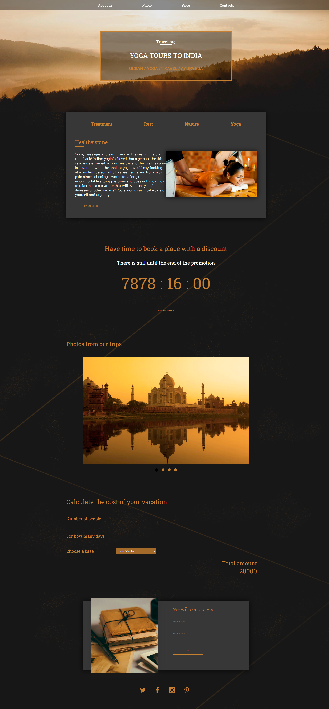
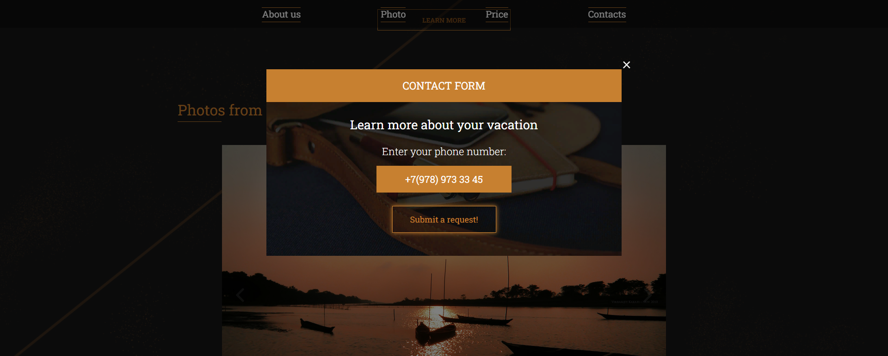

# India Tours Lending Page
<h2>About the project</h2>

Website is a single-page site that encapsulates the serenity and spirituality of Indian yoga tours with a variety of user-friendly features and smooth, aesthetically pleasing animations. Here's a brief overview of the technical functionalities integrated into the website: 
 
<h3>Navigation Bar (Navbar):</h3>
• Provides easy access to all sections of the site, such as About us, Photos, Price, and Contacts. 
• Smooth scrolling animation enhances user experience when navigating between sections. 
 
<h3>Countdown Timer:</h3>
• A prominently featured countdown timer adds urgency by showing the time left until a special discount offer expires. 
• The timer is dynamic, automatically updating in real-time to ensure accuracy. 
 
<h3>Image Slider:</h3>
• A beautiful image slider showcases breathtaking photos from previous tours, allowing users to glimpse the experiences that await them. 
• The slider transitions are smooth and provide an interactive way to view multiple images without manual refresh. 
 
<h3>Vacation Cost Calculator:</h3>
• An interactive calculator where users can estimate the cost of their vacation based on the number of people, duration of stay, and selected base location. 
• It provides an immediate total cost calculation, enhancing the user’s planning experience. 
 
<h3>Contact Form and Modal Window:</h3>
• A user-friendly contact form is readily available for visitors to leave inquiries, which opens in a modal window ensuring the user is not navigated away from the page. 
• This feature is designed for seamless user engagement without disrupting the browsing experience. 
 
<h3>Animations and Interactivity:</h3>
• The website's aesthetic is heightened by smooth and beautiful animations that accompany transitions and interactions, making the user experience feel • dynamic and engaging. 

<!-- 👉 Live Demo: <a href='https://india-tours.com/'>Tenzies Demo</a> -->

<h3>Build with:</h3>

» Vanilla JS  
» Vanilla CSS  
» Vanilla CSS Animation  

 

<h2>Screenshots of the Project 📸</h2>
 
<h3 align='center'>Main Page 🏡</h3>

  

<h3 align='center'>Modal Contact Form 🏆</h3>

